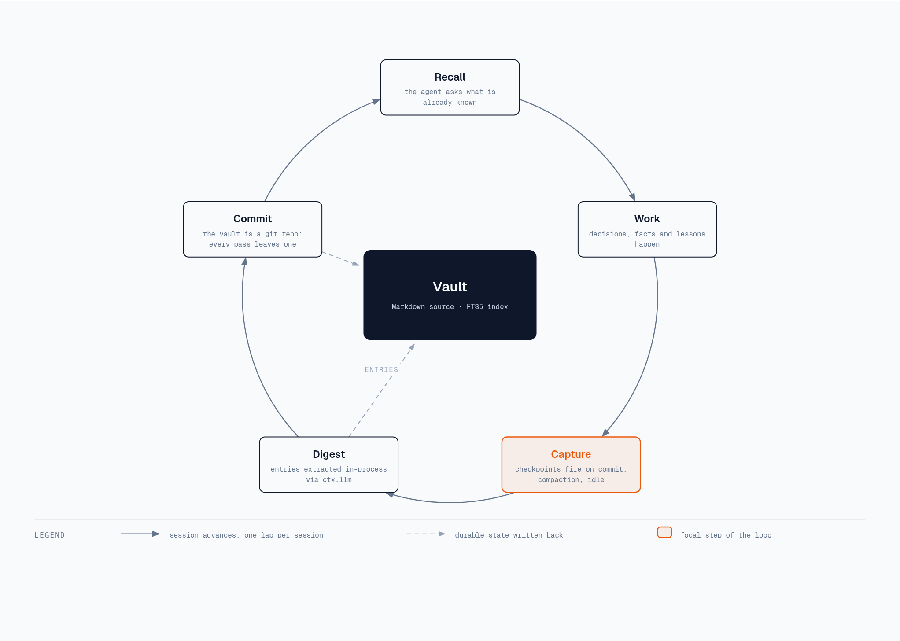

# dsh-memory-vault


Persistent OKF memory for [DeepSeek Harness](https://deepseek-harness.github.io/deepseek-harness/) (DSH):
a Python MCP server (SQLite FTS5 + Markdown), two Cordis plugins (`memory-mcp`, `memory-auto`)
that expose it to the agent as **tools and commands**, and a vault starter with templates and a
type registry.



One lap per session: the agent **recalls** what the vault already knows, **works**, the
checkpoints **capture** what happened, and the digest **commits** the durable state back — so the
next lap starts from a richer record. Markdown stays the source of truth; SQLite FTS5 is an index
derived from it.

## What an install gives you

| | |
|---|---|
| **10 MCP tools** | `search_memory` · `store_decision` · `store_fact` · `store_learning` · `store_convention` · `store_profile` · `store_source` · `export_memories` · `get_profile` · `ping` |
| **3 commands** | `/brain` and `/checkpoint` ship with `memory-mcp`; `/checkpoint-auto` ships with `memory-auto` |
| **Automatic capture** | digests on git commit, compaction and idle — extracted in-process through the harness's own LLM service |
| **A vault** | OKF bundle with per-type templates, a type registry and a tag vocabulary; runtime data is created on first use |

## Install

```sh
# 1. install both plugins (npm, prebuilt — no build approvals, no repo clone)
dsh plugin --profile web add @luisarg/memory-mcp@0.1.6 @luisarg/memory-auto@0.1.6

# 2. launch — first boot installs the vault server under $DSH_HOME (~/.dsh by
#    default) and the vault starter at ~/.memories, automatically
dsh web

# verify
dsh --profile web --dump-config | grep -A8 memory
```

> The version is pinned because pnpm's default `minimumReleaseAge` (3 days) would otherwise
> resolve an older release. Upgrades never overwrite existing vault files: they copy only what
> is missing.

> **Upgrading from 0.1.5**: the default vault moved from `$DSH_HOME/memory-vault` to
> `~/.memories` (the central zone in [`docs/central-zone.md`](docs/central-zone.md)). Entries
> written by 0.1.5 therefore stay in the old directory until you move them
> (`rsync -a --ignore-existing ~/.dsh/memory-vault/projects/ ~/.memories/projects/`) or point
> `DSH_MEMORY_PATH` back at it.

**Developers** (local checkout instead of npm):

```sh
dsh plugin --profile demo add ./packages/memory-mcp ./packages/memory-auto
```

**Offline**: `pnpm --filter @luisarg/memory-mcp pack` and add the `.tgz` files. Installing the
repo root from GitHub is **not** supported (the root has no `dsh.bundle`; pnpm lacks git
subdirectory specs) — use npm or the tarball.

Releases are published by CI: pushing a `v<version>` tag builds, tests, validates the tarballs
and publishes both packages to npm with a
[provenance attestation](https://docs.npmjs.com/generated-provenance-statements), authenticated
by GitHub OIDC — no publish token exists in this repository or on the maintainer's machine. What
runs before an artifact ships is in [`docs/releasing.md`](docs/releasing.md).

## Components

| Component | What it does | Bundle |
|---|---|---|
| `memory-mcp` | MCP stdio client: spawns the vault server, exposes its tools and the `brain` / `checkpoint` skills | `@luisarg/memory-mcp` |
| `memory-auto` | Session hooks + in-process digest, and the `checkpoint-auto` skill | `@luisarg/memory-auto` |
| `memory-vault-server/` | Python MCP server: SQLite FTS5 + Markdown OKF | — |
| `memory-vault/` | Vault starter: templates + type registry + tag vocabulary | — |
| `scripts/digest_session.py` | Optional standalone digest CLI (not used by the plugins) | — |


## Use it

### Ask in the chat

The agent reaches the vault through MCP tools (`mcp__memory__*` — the server is named `memory`);
you do not call them yourself:

| You say | Tool the agent uses |
|---|---|
| "search your memory for `<topic>`" | `search_memory` |
| "remember this: `<fact/decision>`" | `store_decision` / `store_fact` / … |
| "export everything you know about `<project>`" | `export_memories` |
| "summarize my profile" | `get_profile` |

### Bundled skills

Both plugins also ship the commands that drive those tools, so a fresh install gets them without
copying anything into a skill directory:

| Command | Ships with | What it does |
|---|---|---|
| `/brain` | `memory-mcp` | Reads the vault: topic search, recall by project, profile, full export |
| `/checkpoint` | `memory-mcp` | Captures the session as `decision`/`fact`/`learning`/`convention` entries, then commits the vault |
| `/checkpoint-auto` | `memory-auto` | Explains and steers the automatic capture: triggers, the `[memory-checkpoint]` marker, the knobs |

They register at DSH's **bundled** rank, the weakest in the local discovery table, so a skill of
the same name in `~/.agents/skills`, `~/.dsh/skills` or a project's `.agents/skills` still wins —
these are defaults, not a takeover. To override one, copy its `SKILL.md` out of
`packages/*/skills/` into your skill root and edit it: the file is the single source of its own
name, description and usage guidance, so it works in both places.

### Automatic capture

`memory-auto` triggers digests on git commits, compactions and idle sessions. Digests log as
`[memory-auto] …` lines in the harness console, and the entries land under
`<vault>/projects/<project>/<type>/` (Markdown) plus the SQLite FTS5 index. The extraction runs
**in-process** through `ctx.llm` — the credentials DSH is already configured with — so there is no
external CLI and no stored key. Set `enabled: false` in the plugin config to turn it off.

## Configuration

DSH does **not** chdir: the launch directory is irrelevant and paths are absolute. They resolve
in this order:

1. Env vars (override everything): `DSH_MEMORY_PATH`, `DSH_MEMORY_SERVER_DIR`.
2. Defaults: the vault at `~/.memories` (the OS home — `DSH_HOME` does not move it) and
   the server at `$DSH_HOME/memory-vault-server` (`~/.dsh` when `$DSH_HOME` is unset).
3. Profile patch (`cordis.patch.yml`) or `--patch` overlay with explicit values.

| Env var | Used for | Default |
|---|---|---|
| `DSH_MEMORY_PATH` | vault directory (the server receives it as `MEMORY_PATH`) | `~/.memories` |
| `DSH_MEMORY_SERVER_DIR` | directory with `server.py` | `$DSH_HOME/memory-vault-server` |

Plugin-level config (patch layer): `provider` (`deepseek-official`), `model`
(`deepseek-v4-flash`), `maxTokens`, `minTranscriptChars`, `enabled`.

The vault starter is an OKF bundle: `templates/` (one per entry type), `type-registry.yaml`
(source of truth for types) and `tag-vocabulary.json` (tag normalization). Runtime data
(`projects/`, `raw/`, `logs/`, `memory.db`) is created by the server on first use and excluded
from git.

**Runtime for the server**: `uv` on PATH is recommended but not required. The bundled
`launcher.mjs` runs the server with `uv run` when uv is present, and otherwise falls back to a
pip-managed venv (`python3 -m venv` + `pip install -r requirements.txt`; the first boot needs
network). Both packages are self-contained: they ship the Python server and the vault starter.

## Operations

```sh
# composed config shows both bundles with the resolved paths
dsh --profile web --dump-config | grep -A8 memory

# what the vault holds (default vault: ~/.memories)
ls ~/.memories/projects/               # per-project OKF entries
grep -i "digest" ~/.memories/log.md    # digest markers

# talk to the vault MCP server directly (standalone smoke test)
printf '%s\n' \
  '{"jsonrpc":"2.0","id":1,"method":"initialize","params":{"protocolVersion":"2025-06-18","capabilities":{},"clientInfo":{"name":"cli","version":"0"}}}' \
  '{"jsonrpc":"2.0","method":"notifications/initialized"}' \
  '{"jsonrpc":"2.0","id":2,"method":"tools/call","params":{"name":"ping","arguments":{}}}' \
  | MEMORY_PATH=$HOME/.memories uv run --directory memory-vault-server python server.py

# a second harness instance on another port (testing without touching your main session)
pnpm dsh web --port 3090
```

### Troubleshooting pnpm

- `unable to open database file` → the pnpm store is not writable (sandboxed environment). Use
  `--store-dir ./.pnpm-store` on every `pnpm install` and on
  `dsh plugin --profile X --store-dir ./.pnpm-store add ...`.
- `dsh: pnpm failed` when installing from GitHub → only applies to packages with a `prepare`
  script; copy the printed key into the profile's `pnpm-workspace.yaml` (allowBuilds). The
  subpackages of this monorepo cannot be installed with `github:...` at all — use npm or a
  tarball.

## Second MCP client: opencode

The vault is a plain stdio MCP server, so any MCP client can use the same server and the same
vault (see [`docs/central-zone.md`](docs/central-zone.md) for the shared-vault layout). For
opencode, `~/.config/opencode/opencode.json`:

```json
"mcp": {
  "memory-server": {
    "type": "local",
    "command": ["uv", "run", "--directory", "<repo>/memory-vault-server", "python", "server.py"],
    "enabled": true,
    "environment": { "MEMORY_PATH": "<absolute path to your vault>" }
  }
}
```

> The key must be **`environment`** — `env` is silently ignored and the server falls back to the
> default vault. The plugin skills are a DSH feature and do **not** travel over MCP: an opencode
> user who wants the same commands copies the `SKILL.md` files into a directory opencode reads
> (`~/.config/opencode/skills/<name>/SKILL.md`), renaming the tool prefix from `mcp__memory__*`
> to `memory-server_*`.

## Development

```sh
pnpm install
pnpm -r build

# run the harness against the checkout, with an overlay (paths relative to the repo cwd)
dsh web --patch ./examples/dev-memory.cordis.yml
```

```
packages/memory-mcp/          # cordis bundle: MCP stdio client (+ brain, checkpoint skills)
packages/memory-auto/         # cordis bundle: automatic session digest (+ checkpoint-auto skill)
memory-vault-server/          # Python MCP server (SQLite + Markdown OKF)
memory-vault/                 # vault starter (templates + type registry)
scripts/digest_session.py     # optional standalone digest CLI (not used by the plugins)
examples/dev-memory.cordis.yml       # memory-mcp
examples/dev-memory-auto.cordis.yml  # memory-mcp + memory-auto
```

`pnpm -r build` runs each package's build; `pnpm bundle` copies the server and the vault starter
into the packages, so a release tarball is self-contained. CI runs lint, build and the test
suites on every push (`pnpm lint && pnpm -r build && pnpm -r test`).

## Docs

- [`docs/`](docs/README.md) — architecture, diagrams, the central zone, releasing
- [Releasing & version tags](docs/releasing.md) — which commit each `v*` tag maps to
- [Your first plugin](https://deepseek-harness.github.io/deepseek-harness/en/develop/basic/)
- [Build a tool](https://deepseek-harness.github.io/deepseek-harness/en/develop/basic/tool)
- [Plugin configuration](https://deepseek-harness.github.io/deepseek-harness/en/develop/basic/config)
- [Package and install](https://deepseek-harness.github.io/deepseek-harness/en/develop/basic/publish)
