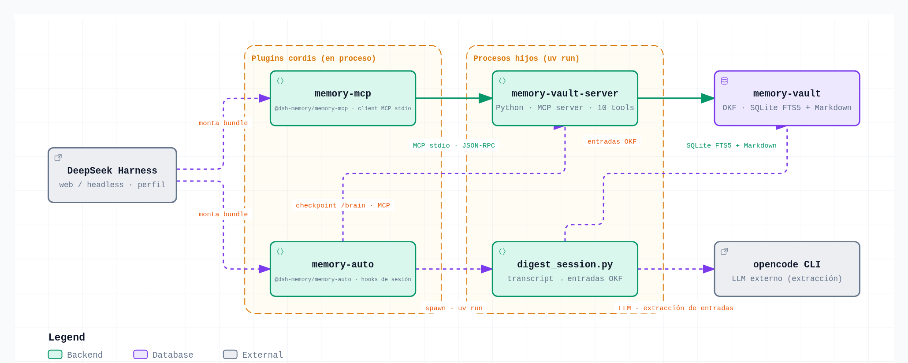
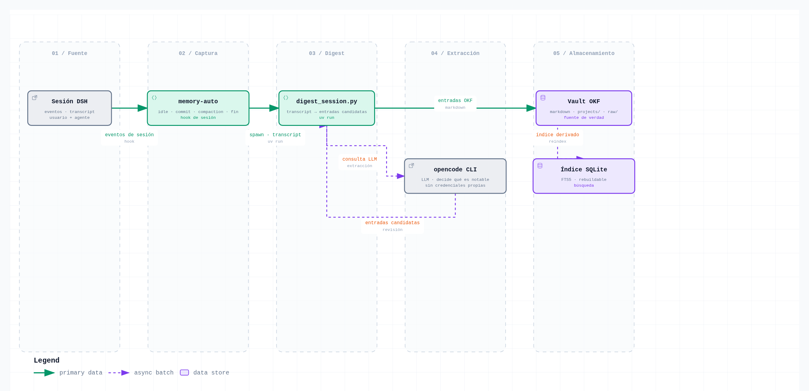
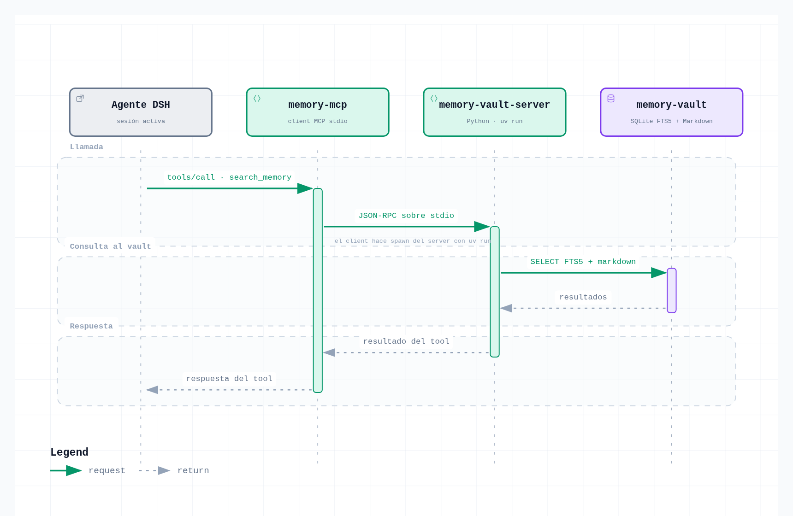
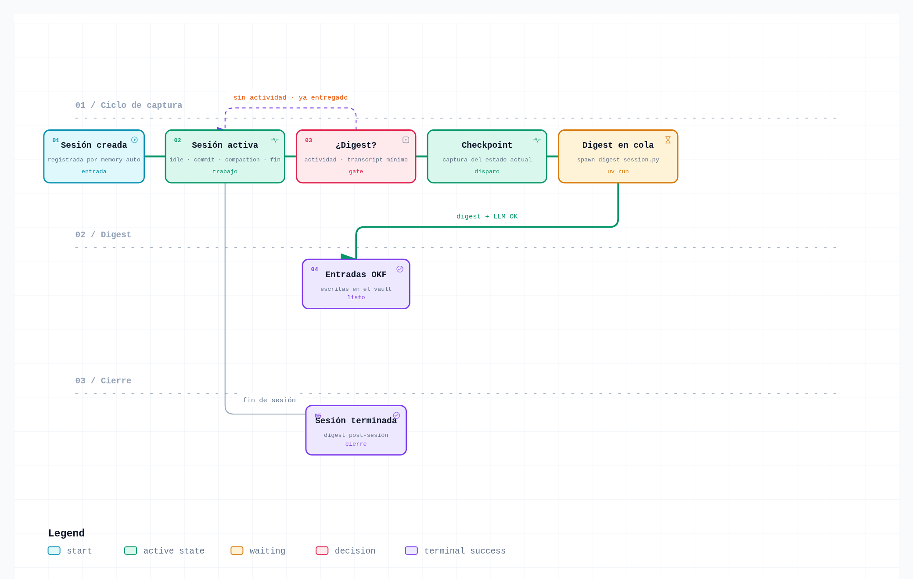

# Architecture

`dsh-memory-vault` is a persistent OKF memory stack for
[DeepSeek Harness](https://deepseek-harness.github.io/deepseek-harness/) (DSH).
Everything installs through the standard plugin flow: each Cordis bundle
declares a `dsh.bundle` manifest and mounts with
`dsh plugin --profile <name> add <package>`.

## Component overview


<sub>[Interactive version](diagrams/stack.html)</sub>

```
DeepSeek Harness (web / headless)  ← plugins mounted in the profile process
├── memory-mcp        @dsh-memory/memory-mcp   MCP stdio client (spawns the server via uv)
├── memory-auto       @dsh-memory/memory-auto  session hooks: idle · commit · compaction · end
│        │ spawn · uv run
│        ▼
│   digest_session.py          transcript → OKF entries via an external LLM CLI
│        │
│        ▼
└── memory-vault-server        Python MCP server · 10 tools
         │ SQLite FTS5 + Markdown
         ▼
    memory-vault                OKF bundle: templates · type-registry · tag-vocabulary
```

- **DSH** is the host: it loads the two bundles as Cordis plugins and exposes
  the vault to the agent as MCP tools.
- **memory-mcp** mounts `@deepseek-ai/dsh-mcp-client` pointed at the vault
  server over stdio (JSON-RPC). Tool calls reach the server, which reads and
  writes the vault.
- **memory-auto** watches the session event stream and triggers checkpoints
  (idle, git commit, compaction, session end). It spawns the digest script
  through `uv run` and delegates LLM extraction to the `opencode` CLI — the
  plugin holds no credentials of its own.
- **memory-vault-server** (`memory-vault-server/`) is a Python MCP server:
  SQLite (WAL + FTS5) as a derived search index over Markdown OKF files, which
  remain the source of truth. It exposes 10 tools: `search_memory`,
  `store_decision`, `store_fact`, `store_learning`, `store_convention`,
  `store_profile`, `store_source`, `export_memories`, `get_profile`, `ping`.
- **memory-vault** (`memory-vault/`) is the starter bundle: OKF templates per
  entry type, `type-registry.yaml` (source of truth for types) and
  `tag-vocabulary.json` (tag normalization). Runtime data (`projects/`,
  `raw/`, `logs/`, `memory.db`) is created on first use and excluded from git.

## Session digest pipeline


<sub>[Interactive version](diagrams/session-digest.html)</sub>

Session events are captured by `memory-auto` at checkpoints. When the gate
passes (activity recorded and transcript ≥ `minTranscriptChars`), the plugin
spawns `digest_session.py` via `uv run`; the digest asks the `opencode` CLI to
extract notable decisions, facts and learnings, reviews the candidates, and
writes OKF entries into the vault. SQLite FTS5 is a derived index, rebuilt
from the Markdown whenever needed.

## MCP tool call


<sub>[Interactive version](diagrams/mcp-tool-call.html)</sub>

The agent issues `tools/call`; `memory-mcp` forwards JSON-RPC over stdio to
`memory-vault-server` (spawned with `uv run`), which queries the store and
returns the tool result. The server runs as a separate process: a server crash
never takes the agent down.

## Per-session capture lifecycle


<sub>[Interactive version](diagrams/capture-lifecycle.html)</sub>

Sessions are registered on creation; the capture rail runs
`created → active → gate → checkpoint → queued → digested`. The gate only
digests when there is recorded activity and a transcript above the minimum.
A failed digest is retried without losing the queue; the session keeps running
in the meantime. On session end the plugin flushes a post-session digest
(dispose path).

## Configuration

All paths are environment-driven, never hardcoded:

| Variable | Used by | Default |
|---|---|---|
| `DSH_MEMORY_PATH` | server (`MEMORY_PATH`), memory-auto, digest | `./memory-vault` |
| `DSH_MEMORY_SERVER_DIR` | memory-mcp (server directory) | `./memory-vault-server` |
| `DSH_DIGEST_SCRIPT` | memory-auto (digest script) | `./scripts/digest_session.py` |
| `DSH_DIGEST_LOG` | memory-auto (spawn log) | `<tmpdir>/dsh-digest-spawn.log` |

Requires `uv` on PATH (the server and the digest run through `uv run`).

## Layer order

1. `dsh.profile.bundles` (base + each installed bundle)
2. `$DSH_HOME/profiles/<name>/cordis.patch.yml`
3. `$DSH_HOME/cordis.patch.yml`
4. `--patch` overlays

Patch replaces `config` wholesale — it does not merge.
